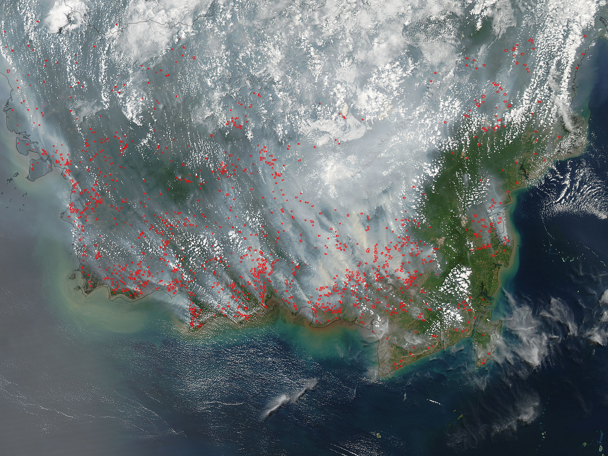
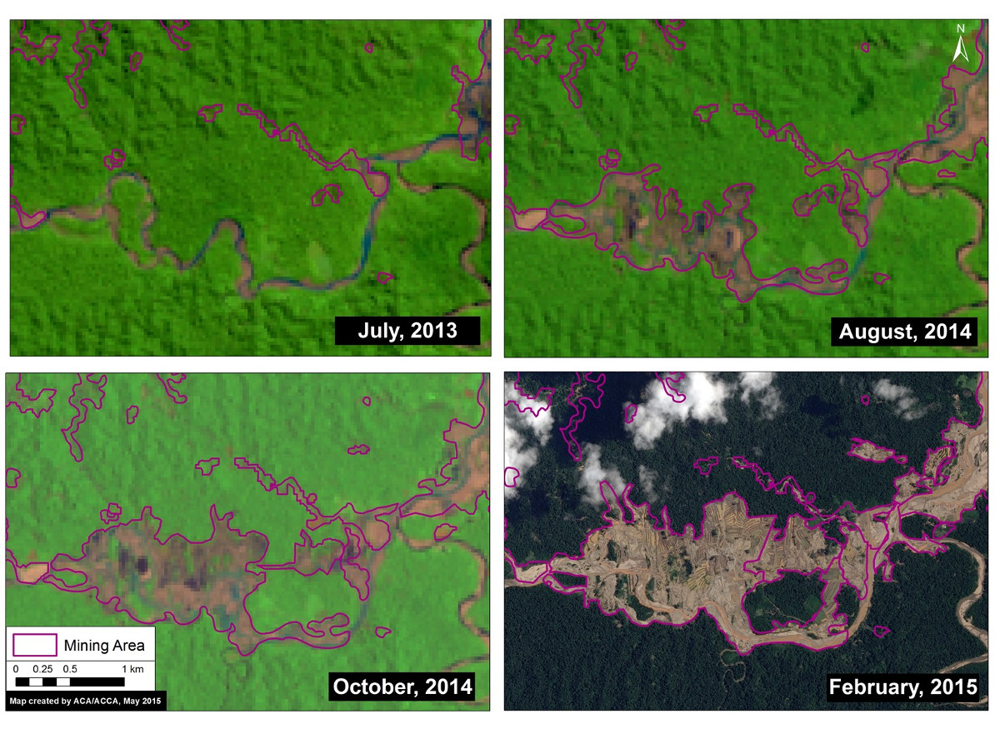
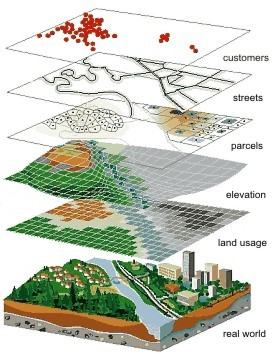
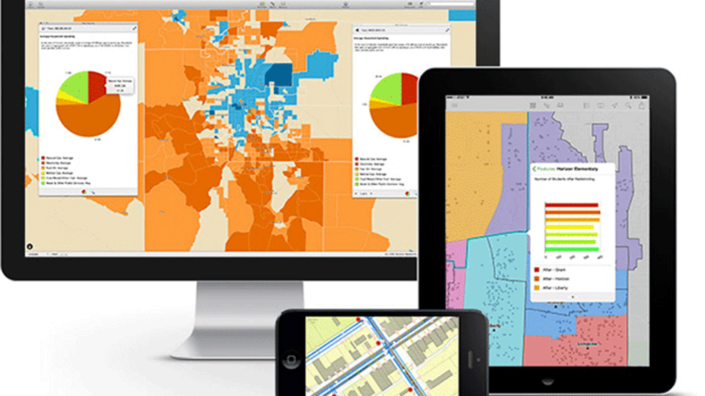
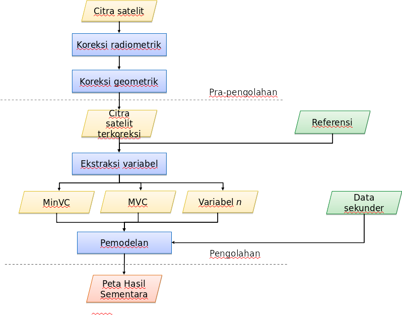
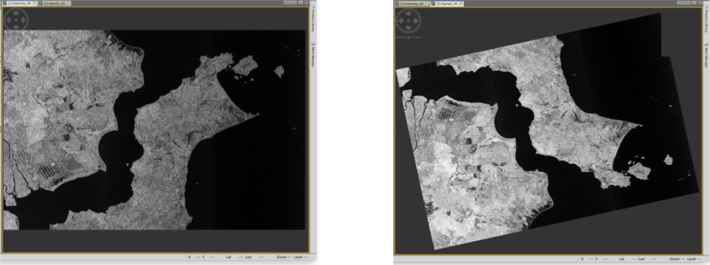
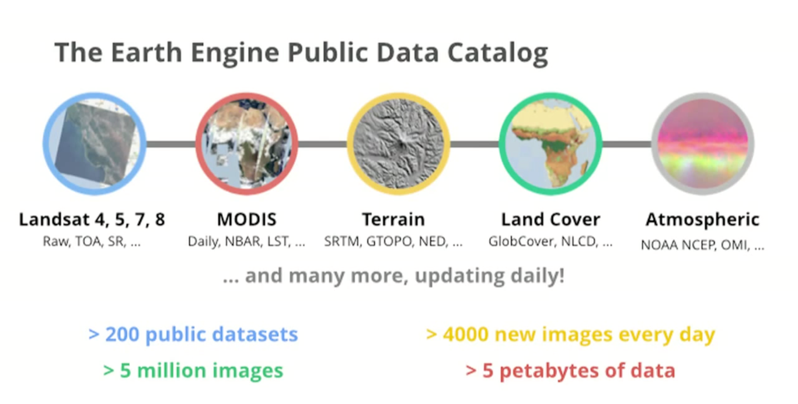
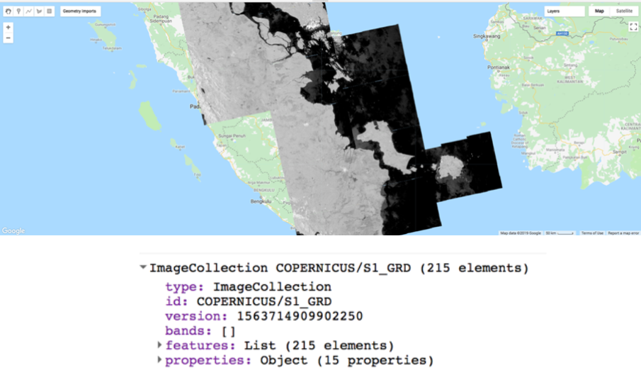

---?color=solid(white)
@title[GEE for Land Monitoring]

@snap[center text-blue text-15]
### Google Earth Engine for Land Monitoring
@snapend

@snap[south]
Firman Hadi
firman@indotechsa.com
@snapend

@snap[north-east span-25]

@snapend

@snap[north-west span-8]

@snapend

---?color=black
@title[Know the battle]

@snap[midpoint span-70]

## Data 
@fa[quote-left](You can't protect what you don't know)

@snapend

---?image=assets/img/presenter.jpg

@snap[north span-100 h2-white]
## Asking the right question
@snapend

@snap[west span-30 text-white text-12]
@ul
- What
- Where
- When
@ulend
@snapend

@snap[center span-120 text-white text-12]
@ul
- Who
- Why
- How
@ulend
@snapend

---?color=black
@title[Land Monitoring]

@snap[midpoint span-70]

### Land Monitoring
@fa[quote-left](Gossip!)

@snapend

---?color=black
@title[Land Monitoring]

@snap[midpoint span-70]

### Land Monitoring
@fa[quote-left](Spreadsheets)

@snapend

---?color=black
@title[Land Monitoring]

@snap[midpoint span-70]

### Land Monitoring
@fa[quote-left](Satellite imageries)

@snapend

---?color=black

@snap[north-east span-140]
## Geospatial analyses
@snapend
@snap[west span-40]

@snapend

@snap[east span-55]
@ul[list-spaced-bullets text-white text-09]
- More than 80% of data related to location
- The human brain doesn't work in rows and columns
- Harness the power of place
@ulend
@snapend

---?color=black
@snap[north span-120]
## Benefits
@snapend

@snap[east span-40]

@snapend

@snap[west span-55]
@ul[list-spaced-bullets text-white text-09]
- Engage analytics with more insight
- Move from hindsight to foresight
- Develop target solutions
@ulend
@snapend

---?color=black

@snap[midpoint span-60]

## The Old Way
@fa[quote-left](long and boring process)

@snapend

---?color=black
## The Oldway

@fa[quote-left](SAR Workflow)

---?color=black
## The Millennial way

---?color=black
## The Millennial way

---
@snap[north-east span-80 text-06 text-gray]
Grab the code at https://code.earthengine.google.com/xxxxx
@snapend

@code[http zoom-6](assets/src/gee.js)(First example)

@snap[south span-100 text-08]
@[1-8,zoom-13]
@[10-14,zoom-16]
@snapend

---
@snap[north-east span-80 text-06 text-gray]
Grab the code at https://code.earthengine.google.com/xxxxx
@snapend

@code[http zoom-6](assets/src/gee1.js)(First example)

@snap[south span-100 text-08]
@[4-11,zoom-13]
@[13-24,zoom-13]
@snapend

---?image=assets/img/presenter.jpg

@snap[north span-100 h2-white]
## Any question?
@snapend

@snap[south span-100 text-06]
[https://gitpitch.com/firmanhadi/pitch_fmipa-untan](https://gitpitch.com/firmanhadi/pitch_fmipa-untan)
@snapend
